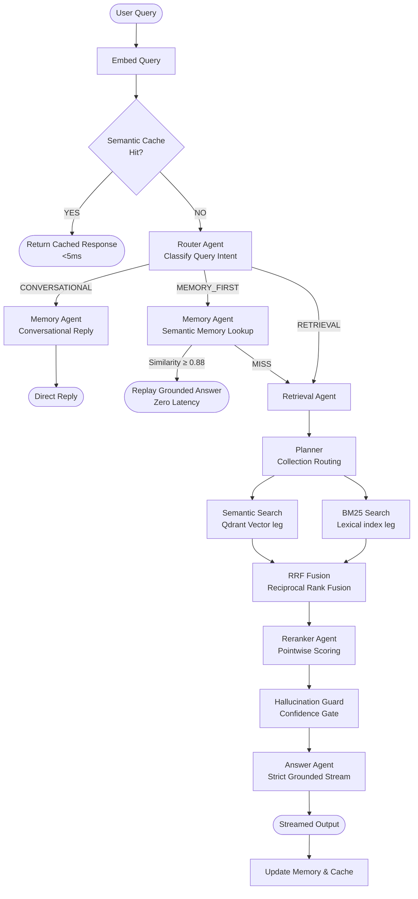
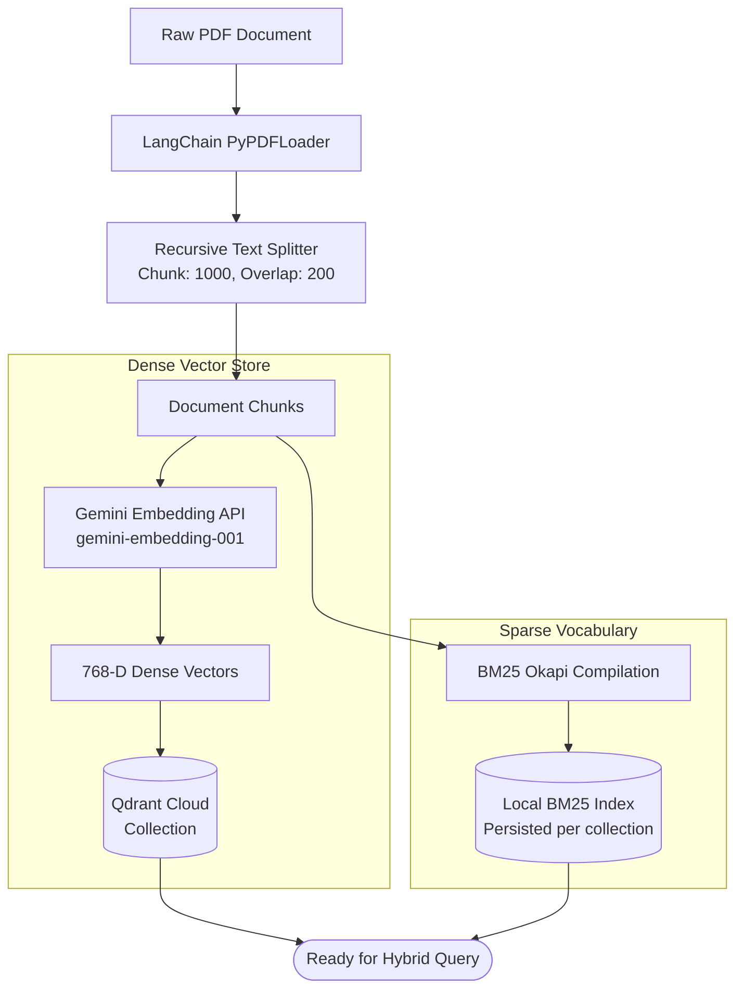

# Multi-Source Agentic RAG System

A production-grade, multi-agent Retrieval-Augmented Generation (RAG) system engineered for high-accuracy domain searching, conversational state awareness, and isolated multi-tenant knowledge base retrieval. The platform coordinates a network of autonomous agents to deliver grounded, low-latency, and hallucination-free streaming answers.

---

## 🏗️ System Architecture

The core processing engine is managed by a central **Orchestrator** that handles query lifecycle routing, memory lookup, search orchestration, reranking, trust guards, and response synthesis:



---

## 📥 Data Ingestion Workflow

The ingestion pipeline handles documents asynchronously, preparing text fragments for both dense semantic (vectorial) and sparse lexical (token-based) querying:



### Ingestion Mechanics:
1.  **Parsing & Chunking**: Incoming PDF documents are processed through `PyPDFLoader`. Text is split recursively using character indicators to preserve paragraph structure, using a maximum length of 1000 characters per chunk and a 200-character boundary overlap.
2.  **Dense Embedding**: Chunks are mapped to 768-dimensional float vectors via Google's Embedding API and stored inside designated Qdrant collections.
3.  **BM25 Lexical Building**: To prevent loss of exact-keyword recall (e.g., specific ID numbers, code tokens, function names), the system compiles a local vocabulary list and builds a sparse index using the BM25 Okapi mathematical formula, persisting it directly alongside the collection.

---

## 🤖 Agentic Pipeline Layers

### 1. Router Agent
Inspects incoming query syntax and intent to instantly route to one of three optimal pipelines:
*   **CONVERSATIONAL**: Triggered on short greetings, inquiries about identity, or expressions of thanks. Bypasses database queries and routes directly to a lightweight conversational LLM wrapper to minimize resource usage.
*   **MEMORY_FIRST**: Detects contextual follow-ups referencing previous turn statements (*"Explain that again"*, *"What was that first point?"*). Prioritizes conversational memory retrieval.
*   **RETRIEVAL**: Directs standard search and domain-specific queries into the retrieval pipeline.

### 2. Memory Agent
Owns the conversation history and operates an intelligent cache mechanism:
*   **Caching Turn Embeddings**: Every time a user submits a query, its dense vector representation is cached.
*   **Semantic Replay**: On successive turns, the agent performs a cosine similarity lookup against recent turns. If a query matches a past question with a similarity score of **`≥ 0.88`**, it immediately replays the previous answer. This guarantees instant, cost-free, and hallucination-free generation for repeating query themes.

### 3. Retrieval Agent
Coordinates multi-source hybrid search across vector and lexical databases:
*   **Ensemble Query Planner**: When searching universally, matches the semantic context of the query against indexed knowledge collections to select target databases, bypassing unrelated pools.
*   **Targeted Isolation**: Bypasses the planner when a user is locked to a specific Knowledge Base page, forcing retrieval to target a single collection only.
*   **Dense Semantic Search**: Conducts cosine similarity lookup on **Qdrant Cloud** databases using **Google Gemini Embeddings** (`gemini-embedding-001`).
*   **Sparse Lexical Search**: Runs lexical lookup using **BM25 Okapi** on the raw token text index of the documents in parallel.
*   **RRF Fusion**: Combines ranks from semantic and lexical searches using Reciprocal Rank Fusion (RRF) to merge the best of conceptual matching and keyword exactness.

### 4. Reranker Agent
Mitigates the "lost-in-the-middle" prompt problem. It bundles the top candidates returned by the fusion step and issues a single batch pointwise scoring call to Gemini:
*   Documents are scored from `0.0` to `1.0` based on specific information-seeking relevance.
*   The results are sorted, positioning the highest quality reference paragraphs at the top of the context block.
*   Includes a safe fallback that preserves the original RRF rank order if the LLM output fails validation.

### 5. Hallucination Guard
Serves as the system's reliability gate. It inspects the raw cosine similarity scores of the retrieved references before generation:
*   If the top similarity scores fail to cross the confidence threshold, the guard advises the generator to return a standard out-of-domain boundary answer (*"I do not have enough context in my database to answer this accurately"*), completely preventing contextual hallucination.

### 6. Answer Agent
Responsible for final prose synthesis:
*   Receives the reranked context paragraphs, conversation history, and guard advisories.
*   Employs a strict system grounding prompt to write direct answers.
*   Streams raw character tokens to the client in real-time.

---

## 🎛️ Pipeline Execution Paths

The system dynamically adapts to incoming queries, using three distinct routing paths to maximize speed and minimize compute costs:

### Path A: Conversational Route (Latency: <5ms)
*   **Trigger**: Conversational prompts (e.g. *"Hello"*, *"Who are you?"*).
*   **Route**: `User Query` ➔ `Router` ➔ `Memory Agent (Conversational Reply)` ➔ `Stream Response`.
*   **Performance**: Zero vector retrieval, zero database connections, single fast LLM turn.

### Path B: Memory Hit Route (Latency: <10ms)
*   **Trigger**: cosine similarity `≥ 0.88` between the new query embedding and any stored query in the last 6 turns.
*   **Route**: `User Query` ➔ `Router` ➔ `Memory Agent (Semantic Check)` ➔ `Stream Past Response`.
*   **Performance**: Zero LLM generation latency, zero token costs, complete protection against hallucination.

### Path C: Full Hybrid Search Route (Latency: ~1.2s - 2.5s)
*   **Trigger**: Standard informational query.
*   **Route**: `User Query` ➔ `Router` ➔ `Retrieval Agent` (Parallel Semantic & BM25) ➔ `RRF Fusion` ➔ `Gemini Pointwise Reranking` ➔ `Hallucination Guard` ➔ `Answer Agent (Streaming Synthesis)`.
*   **Performance**: Full multi-agent parsing, document comparison, validation checks, and streaming.

---

## ⚙️ Core Configuration Parameters

Fine-tune retrieval and security behaviors using constants defined in `retrieval/retriever.py` and `agents/orchestrator.py`:

| Constant | Default Value | Role |
| :--- | :--- | :--- |
| `MIN_SCORE` | `0.20` | Minimum cosine similarity required to include a semantic chunk. Blocks unrelated noise. |
| `VECTOR_FETCH_K` | `12` | The number of vector candidates to retrieve per collection before applying thresholds. |
| `RERANK_MIN_DOCS` | `5` | Reranker threshold. Rerank only when having 5 or more candidate documents to prevent redundant LLM calls. |
| `COLLECTION_CONFIDENCE` | Custom Map | Multipliers applied to collection scores (e.g., `code_docs: 1.2` boosts code relevance over general text). |

---

## 🖥️ Multi-Page Interface Design

The frontend is constructed using a high-fidelity, flat charcoal black design system tailored for enterprise workflows:

*   **Grayscale Surfaces**: Obsidian dark mode styling utilizing deep charcoal bases (`#0f0f0f`), dark gray panels (`#171717`), and clean borders (`#2d2d2d`).
*   **Vibrant Accents**: Dark teal highlights (`#0d9488`) isolated to main headers, navigation focus frames, primary action icons, and status components.
*   **Independent Assistant Views**: Separates RAG contexts into five distinct page tabs:
    1.  **Universal Assistant**: Queries all collections.
    2.  **Research Papers Assistant**: Restricted to the `research_papers` collection.
    3.  **Knowledge Base Assistant**: Restricted to the `knowledge_base` collection.
    4.  **Code Docs Assistant**: Restricted to the `code_docs` collection.
    5.  **FAQ Data Assistant**: Restricted to the `faq_data` collection.
*   **State Isolation**: Swapping views preserves local state, maintaining unique message histories, load indicators, session IDs, and text input values for each specific assistant.
*   **Context-Aware Ingestion**: Dragging and dropping or selecting a document automatically targets the collection corresponding to the active assistant tab.
*   **Real-time Status Tracking**: Renders dynamic collection sizes showing point counts directly in the sidebar.

---

## 🌐 API Specification

### 1. Unified Chat Endpoint
Issues queries to the multi-agentic RAG pipeline.

*   **URL**: `/chat`
*   **Method**: `POST`
*   **Headers**: `Content-Type: application/json`
*   **Payload (JSON)**:
    ```json
    {
      "question": "What is self-attention?",
      "session_id": "user-session-abc",
      "collections": ["research_papers"]
    }
    ```
    *Note: Leaving `"collections": null` initiates a universal search across all knowledge pools.*
*   **Response**: `text/plain` chunk-by-chunk stream.

### 2. Document Ingestion Endpoint
Ingests a single PDF file into the specified database collection.

*   **URL**: `/upload?collection=code_docs`
*   **Method**: `POST`
*   **Payload**: `multipart/form-data` (binary PDF file)
*   **Response (JSON)**:
    ```json
    {
      "filename": "api_specs.pdf",
      "chunks_ingested": 18,
      "collection": "code_docs",
      "message": "Successfully ingested 18 chunks from 'api_specs.pdf'. BM25 index refreshed."
    }
    ```

### 3. Collection Status Endpoint
Retrieves point counts and lexical indexing states.

*   **URL**: `/collections`
*   **Method**: `GET`
*   **Response (JSON)**:
    ```json
    {
      "collections": [
        {
          "name": "research_papers",
          "points_count": 1420,
          "vectors_count": 1420,
          "bm25_docs": 8,
          "bm25_ready": true
        }
      ]
    }
    ```

---

## 📁 System Blueprint

```
backend/
├── main.py                 # API entry point & HTTP router
├── core/
│   ├── config.py           # Config loader (env variables)
│   ├── llm.py              # LLM configuration (Gemini)
│   ├── embeddings.py       # Embedding API setup
│   └── qdrant_client.py    # Vector database client
├── agents/
│   ├── base.py             # Agent interface & latency tracker
│   ├── orchestrator.py     # Master agent pipeline coordinator
│   ├── router.py           # Intent classification agent
│   ├── memory_agent.py     # State, similarity cache & conversational agent
│   ├── retrieval_agent.py  # Planner & hybrid search agent
│   ├── reranker.py         # Pointwise relevance reranking agent
│   └── answer_agent.py     # Answer generation agent
├── retrieval/
│   ├── retriever.py        # Semantic + BM25 parallel search
│   ├── hybrid.py           # RRF ranks fusion algorithm
│   ├── planner.py          # Dynamic keyword routing map
│   ├── guard.py            # Confidence and hallucination evaluation
│   └── bm25_index.py       # BM25 lexical index manager
├── ingestion/
│   └── ingestion.py        # PDF chunking, embedding, and database loading
├── memory/
│   └── memory.py           # Chat history registry
└── cache/
    └── cache.py            # Semantic cache storage

frontend/
├── app/
│   ├── page.tsx            # Multi-mode RAG client interface
│   ├── layout.tsx          # Font and layout configs
│   └── globals.css         # Flat dark mode CSS variables
└── package.json            # Client packages mapping
```
