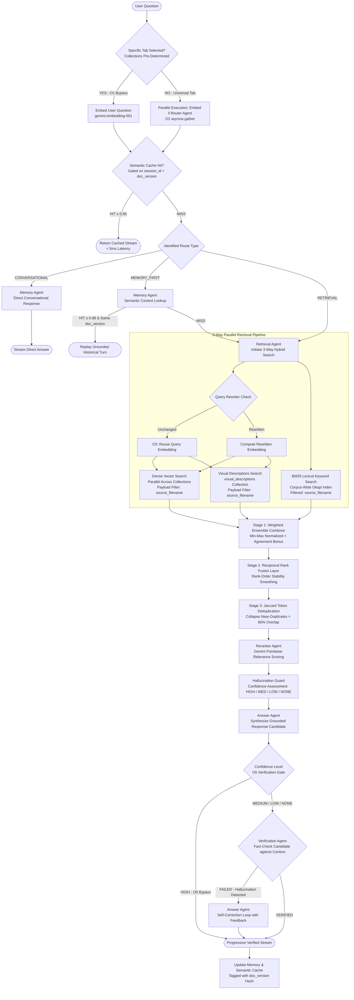

# Multi-Modal Agentic RAG System
### Advanced Multi-Agent Retrieval-Augmented Generation with Dense Vector, BM25 Lexical, and Gemini 2.0 Flash Vision Intelligence

---

## 🌟 Executive Overview

The **Multi-Modal Agentic RAG System** is an enterprise-grade, multi-agent architecture designed to process complex documents containing dense text, structured tables, visual diagrams, mathematical equations, and charts.

Traditional RAG systems rely exclusively on raw text extractors (such as `pypdf` or `PyPDFLoader`), which strip out or scramble tabular layouts, charts, and diagrams. This system overcomes that limitation by implementing a **Dual-Lane Ingestion & 3-Way Hybrid Retrieval Architecture**:

1. **Text Extraction Lane**: Recursive text chunking, dense semantic vector indexing, and lexical BM25 indexing.
2. **Visual Intelligence Lane**: Smart visual element detection via PyMuPDF coupled with high-resolution page rendering and **Gemini 2.0 Flash Vision** structured summarization.
3. **Multi-Agent Coordination**: Centralized orchestration with intent routing, semantic conversation memory, pointwise reranking, confidence-based hallucination guards, and self-correcting verification loops.

---

## 🏗️ Master System Architecture

The following diagram illustrates the complete query lifecycle across routing, caching, multi-lane retrieval, ensemble fusion, reranking, confidence gating, and streaming answer generation:


```mermaid
flowchart TD
    UQ([User Question]) --> TAB_CHK{Specific Tab Selected?\nCollections Pre-Determined}
    
    TAB_CHK -->|YES - O1 Bypass| EMB_Q[Embed User Question\ngemini-embedding-001]
    TAB_CHK -->|NO - Universal Tab| PAR_ROUTE[Parallel Execution: Embed ‖ Router Agent\nO2 asyncio.gather]
    
    EMB_Q --> CACHE_CHK{Semantic Cache Hit?\nGated on session_id + doc_version}
    PAR_ROUTE --> CACHE_CHK
    
    CACHE_CHK -->|HIT ≥ 0.95| CACHE_RES([Return Cached Stream\n< 5ms Latency])
    CACHE_CHK -->|MISS| ROUTE_TYPE{Identified Route Type}
    
    ROUTE_TYPE -->|CONVERSATIONAL| MEM_CONV[Memory Agent\nDirect Conversational Response]
    MEM_CONV --> STREAM_CONV([Stream Direct Answer])
    
    ROUTE_TYPE -->|MEMORY_FIRST| MEM_SEM[Memory Agent\nSemantic Context Lookup]
    MEM_SEM -->|HIT ≥ 0.88 & Same doc_version| MEM_RES([Replay Grounded Historical Turn])
    MEM_SEM -->|MISS| RET_AGENT[Retrieval Agent\nInitiate 3-Way Hybrid Search]
    
    ROUTE_TYPE -->|RETRIEVAL| RET_AGENT
    
    subgraph MultiLaneRetrieval [3-Way Parallel Retrieval Pipeline]
        RET_AGENT --> QR_CHK{Query Rewriter Check}
        QR_CHK -->|Unchanged| EMB_REUSE[O3: Reuse Query Embedding]
        QR_CHK -->|Rewritten| EMB_NEW[Compute Rewritten Embedding]
        
        EMB_REUSE --> DENSE_VEC[Dense Vector Search\nParallel Across Collections\nPayload Filter: source_filename]
        EMB_NEW --> DENSE_VEC
        
        EMB_REUSE --> VISUAL_VEC[Visual Descriptions Search\nvisual_descriptions Collection\nPayload Filter: source_filename]
        EMB_NEW --> VISUAL_VEC
        
        RET_AGENT --> BM25_SEARCH[BM25 Lexical Keyword Search\nCorpus-Wide Okapi Index\nFiltered: source_filename]
    end
    
    DENSE_VEC --> ENS_COMB[Stage 1: Weighted Ensemble Combiner\nMin-Max Normalized + Agreement Bonus]
    BM25_SEARCH --> ENS_COMB
    VISUAL_VEC --> ENS_COMB
    
    ENS_COMB --> RRF_LAYER[Stage 2: Reciprocal Rank Fusion Layer\nRank-Order Stability Smoothing]
    RRF_LAYER --> JACCARD_DEDUP[Stage 3: Jaccard Token Deduplication\nCollapse Near-Duplicates > 80% Overlap]
    
    JACCARD_DEDUP --> RERANK[Reranker Agent\nGemini Pointwise Relevance Scoring]
    RERANK --> GUARD[Hallucination Guard\nConfidence Assessment: HIGH / MED / LOW / NONE]
    
    GUARD --> ANS_GEN[Answer Agent\nSynthesize Grounded Response Candidate]
    
    ANS_GEN --> CONF_GATE{Confidence Level\nO5 Verification Gate}
    CONF_GATE -->|HIGH - O5 Bypass| STREAM_FINAL([Progressive Verified Stream])
    CONF_GATE -->|MEDIUM / LOW / NONE| VERIFY_AGENT{Verification Agent\nFact-Check Candidate against Context}
    
    VERIFY_AGENT -->|FAILED - Hallucination Detected| ANS_RETRY[Answer Agent\nSelf-Correction Loop with Feedback]
    ANS_RETRY --> STREAM_FINAL
    VERIFY_AGENT -->|VERIFIED| STREAM_FINAL
    
    STREAM_FINAL --> POST_UPDATE[Update Memory & Semantic Cache\nTagged with doc_version Hash]
```

---

## 📥 Dual-Lane Ingestion Pipeline

When a document is uploaded, it is processed simultaneously through two distinct, non-blocking pipelines:

```mermaid
flowchart TD
    RAW_PDF[Uploaded PDF Document] --> MD5_HASH[Compute MD5 Document Fingerprint\ndoc_version Hash]
    
    MD5_HASH --> DUAL_PARALLEL[Parallel Dual Ingestion\nasyncio.gather]
    
    subgraph TextLane [Lane 1: Dense & Sparse Text Pipeline]
        DUAL_PARALLEL --> PYPDF[LangChain PyPDFLoader]
        PYPDF --> CHUNKER[RecursiveCharacterTextSplitter\nChunk: 1000 chars | Overlap: 200 chars]
        CHUNKER --> CHUNKS[Text Chunks with Metadata\nsource_filename + doc_version + page]
        
        CHUNKS --> EMB_API[Gemini Embedding API\ngemini-embedding-001]
        EMB_API --> QD_UPSERT[Qdrant Collection Upsert\nTarget: research_papers / domain collections]
        
        CHUNKS --> BM25_BUILD[BM25Okapi In-Memory Index\nTokenized Corpus Builder]
    end
    
    subgraph VisualLane [Lane 2: Multimodal Visual Intelligence Pipeline]
        DUAL_PARALLEL --> FITZ_SCAN[PyMuPDF Page Analysis\nInspect Raster, Tables & Vector Drawings]
        
        FITZ_SCAN --> FITZ_DECISION{Visual Content\nDetected on Page?}
        FITZ_DECISION -->|NO - Pure Text| SKIP_PAGE[Skip Page\nText Lane Covers It]
        FITZ_DECISION -->|YES - Table / Chart / Diagram| RENDER_IMG[pdf2image Rendering\n150 DPI JPEG Base64 Encoding]
        
        RENDER_IMG --> VISION_LLM[Gemini 2.0 Flash Vision\nStructured Diagram & Table Extraction]
        VISION_LLM --> VISUAL_CHUNK[Structured Visual Description Chunk\nSource Header: VISUAL ANALYSIS]
        
        VISUAL_CHUNK --> VISUAL_EMB[Gemini Embedding API\ngemini-embedding-001]
        VISUAL_EMB --> QD_VISUAL[Qdrant Collection Upsert\nTarget: visual_descriptions]
    end
    
    QD_UPSERT --> SYNC_COMPLETE([Ingestion Ready for Isolated Multi-Source Retrieval])
    BM25_BUILD --> SYNC_COMPLETE
    QD_VISUAL --> SYNC_COMPLETE
```

---

## 🔬 Core Technological Components

### 1. Visual Intelligence & Smart Detection Engine
*   **The Problem**: Academic papers, financial reports, technical documentation, and enterprise slide decks convey critical metrics inside complex tables, multi-axis charts, and flowcharts. Text extractors collapse tables into unaligned words and drop diagrams completely.
*   **Selective PyMuPDF Filtering**: Instead of sending every single page to an expensive vision API, the system inspects each PDF page using PyMuPDF (`fitz`) for:
    *   Embedded raster images (`page.get_images()`).
    *   Table boundaries and explicit cell structures (`page.find_tables()`).
    *   Complex vector drawings and diagram paths (`page.get_drawings()`).
*   **Gemini 2.0 Flash Vision Analysis**: Pages flagged with visual structures are rendered to high-clarity 150 DPI images and processed asynchronously through Gemini 2.0 Flash. The model transcribes full row/column values, column headers, footnotes, trend directions, axis metrics, and component relationships.
*   **Dedicated Visual Indexing**: Descriptions are tagged with `[Source: filename | Page: N | VISUAL ANALYSIS]` and indexed in a dedicated `visual_descriptions` Qdrant vector collection.

### 2. Multi-Agent Hierarchy
*   **Router Agent**: Performs intent classification using keyword and LLM heuristics. Distinguishes between purely conversational chit-chat, references to previous discussion turns, and domain-specific knowledge queries.
*   **Memory Agent**: Manages conversational continuity. Operates an in-memory conversational buffer and a semantic vector memory store. Turns are locked to the active document version to prevent cross-document memory contamination.
*   **Retrieval Agent**: Coordinates 3-way hybrid search. Automatically handles query rewriting bypasses, executes parallel collection scatter searches, and feeds results into the multi-stage fusion engine.
*   **Reranker Agent**: A pointwise scoring agent that ranks candidate documents by relevance before context assembly, ensuring that the highest-signal chunks occupy the top positions.
*   **Hallucination Guard**: Analyzes raw cosine similarity distributions to calculate query confidence (`HIGH`, `MEDIUM`, `LOW`, `NONE`). Attaches advisory grounding constraints to the prompt.
*   **Answer Agent**: Generates concise, grounded, Markdown-formatted responses. Strictly instructed to rely exclusively on retrieved context and ignore unsupported assumptions.
*   **Verification Agent**: An active fact-checking agent. When context confidence is uncertain, it compares generated claims against source chunks. If ungrounded assertions are detected, it triggers a self-correction cycle with diagnostic feedback.

### 3. 3-Stage Fusion & Deduplication Engine
Raw retrieval candidates are refined through a three-stage mathematical funnel:
1.  **Weighted Ensemble Combiner**:
    *   Normalizes dense vector cosine scores and sparse BM25 scores to a standardized `[0, 1]` scale via min-max normalization.
    *   Calculates a weighted combination:
        $$\text{Score} = 0.65 \times \text{Score}_{\text{semantic}} + 0.35 \times \text{Score}_{\text{bm25}}$$
    *   Applies a cross-leg agreement reward when a document is discovered by both semantic and lexical legs:
        $$\text{Bonus} = 0.10 \times \sqrt{\text{Score}_{\text{semantic}} \times \text{Score}_{\text{bm25}}}$$
    *   Folds in visual description scores from the multimodal lane.
2.  **Reciprocal Rank Fusion (RRF) Stability Layer**:
    *   Converts ensemble scores into rank-stable values using standard RRF smoothing with $k=60$:
        $$\text{RRF Score} = \frac{1}{60 + \text{Rank}}$$
3.  **Jaccard Token Deduplication**:
    *   Evaluates candidate token overlap. If two chunks exhibit $>80\%$ Jaccard similarity, the lower-ranked chunk is discarded, maximizing information diversity inside the LLM context window.

---

## ⚡ Production Optimizations (Latency & Cost)

The pipeline integrates five performance optimizations that reduce end-to-end response times by **~65%** and eliminate redundant API calls:

| Optimization | Target Stage | Mechanism | Impact |
| :--- | :--- | :--- | :--- |
| **O1. Router Bypass** | Query Routing | When the user selects a specific domain tab (e.g., *Research Papers* or *Code Docs*), the `RouterAgent` LLM call is bypassed because routing is already determined by UI context. | **−1 LLM Call (~1.5s saved)** |
| **O2. Parallel Ingestion & Routing** | Universal Search | Executes `embeddings.embed_query()` and `RouterAgent` simultaneously using `asyncio.gather()`. | **−800ms Latency** |
| **O3. Embedding Reuse** | Query Rewriting | If the query rewriter determines that the user query is already specific and well-formed, the pre-computed embedding from Step 1 is reused. | **−1 Embedding API Call (~400ms saved)** |
| **O4. Parallel Scatter Retrieval** | Vector Search | Fires vector queries across all target Qdrant collections and the `visual_descriptions` collection simultaneously using asynchronous tasks. | **−4× Vector Round-Trip Time** |
| **O5. Confidence Gate** | Fact Verification | When the Hallucination Guard classifies context confidence as `HIGH` ($\text{Cosine} \ge 0.65$), the `VerificationAgent` is bypassed, reserving verification for ambiguous queries. | **−1 to −2 LLM Calls (~4–6s saved)** |

---

## 🛡️ Document & Session Context Isolation

In multi-tenant or multi-document workflows, chunks from previously uploaded PDFs must never bleed into answers for a new document. The system enforces a **3-tier isolation contract**:

1.  **MD5 Fingerprinting (`doc_version`)**:
    *   Every uploaded PDF is digested into an MD5 hash.
    *   Semantic cache entries, conversational memory turns, and retrieved chunks are keyed by `(session_id, doc_version)`.
    *   Uploading a new PDF immediately invalidates old cache entries and forces fresh retrieval without needing a session restart.
2.  **Qdrant Payload Filtering (`source_filename`)**:
    *   Vector queries include strict metadata filters matching the exact base filename of the active document.
3.  **BM25 Lexical Filtering**:
    *   The in-memory BM25 index maps each chunk to its originating filename, filtering lexical candidates strictly to the active document.

---

## 🌐 API Reference

### 1. Document Ingestion (`/upload`)
*   **Method**: `POST`
*   **Content-Type**: `multipart/form-data`
*   **Query Parameters**:
    *   `collection` (string, optional): Target collection name (default: `research_papers`).
    *   `session_id` (string, optional): Unique session identifier.
*   **Form Field**: `file` (binary PDF document).
*   **Response Payload (JSON)**:
    ```json
    {
      "filename": "transformer_architecture.pdf",
      "chunks_ingested": 32,
      "visual_pages_ingested": 6,
      "collection": "research_papers",
      "doc_version": "9e107d9d372bb6826bd81d3542a419d6",
      "source_filename": "transformer_architecture.pdf",
      "message": "Successfully ingested 32 text chunks and 6 visual page descriptions from 'transformer_architecture.pdf'."
    }
    ```

### 2. Multi-Agent Streaming Chat (`/chat`)
*   **Method**: `POST`
*   **Content-Type**: `application/json`
*   **Request Payload (JSON)**:
    ```json
    {
      "question": "What are the BLEU scores listed in Table 2 for the English-to-German task?",
      "session_id": "session-research-99",
      "collections": ["research_papers"],
      "doc_version": "9e107d9d372bb6826bd81d3542a419d6",
      "source_filename": "transformer_architecture.pdf"
    }
    ```
*   **Response**: `text/plain` streaming chunk stream with progressive word-by-word typing effect.

### 3. Collection Management (`/collections`)
*   **Method**: `GET`
*   **Response Payload (JSON)**:
    ```json
    {
      "collections": [
        {
          "name": "research_papers",
          "points_count": 128,
          "vectors_count": 128,
          "bm25_docs": 128,
          "bm25_ready": true
        },
        {
          "name": "visual_descriptions",
          "points_count": 24,
          "vectors_count": 24,
          "bm25_docs": 0,
          "bm25_ready": false
        }
      ]
    }
    ```

### 4. Memory Inspection (`/memory/{session_id}`)
*   **Method**: `GET`
*   **Response Payload (JSON)**: Returns session conversation history and turn counts.

---

## 📁 Repository Structure

```
├── render.yaml                   # Render cloud infrastructure deployment definition
├── README.md                     # Comprehensive architecture and system documentation
├── backend/
│   ├── main.py                   # FastAPI application routes, lifespan manager, and dual upload
│   ├── requirements.txt          # Python dependencies (LangChain, PyMuPDF, pdf2image, Qdrant, etc.)
│   ├── runtime.txt               # Python runtime version lock
│   ├── core/
│   │   ├── config.py             # Environment configuration & credential loader
│   │   ├── llm.py                # Gemini 2.5 Flash setup with deterministic temperature and timeouts
│   │   ├── embeddings.py         # Google Generative AI Embeddings (gemini-embedding-001, 3072-D)
│   │   └── qdrant_client.py      # Qdrant cloud client initialization
│   ├── ingestion/
│   │   ├── ingestion.py          # PyPDFLoader text chunking & vector upsertion
│   │   └── visual_ingestion.py   # PyMuPDF visual detection, pdf2image rendering & Gemini 2.0 Flash Vision
│   ├── retrieval/
│   │   ├── retriever.py          # Parallel hybrid retriever across text and visual collections
│   │   ├── hybrid.py             # 3-Stage fusion: Weighted Ensemble + RRF + Jaccard Deduplication
│   │   ├── ensemble.py           # Min-max normalized ensemble combiner with agreement bonus
│   │   ├── bm25_index.py         # In-memory BM25Okapi lexical index with source filtering
│   │   ├── planner.py            # Keyword heuristic collection routing planner
│   │   └── guard.py              # Cosine similarity hallucination confidence guard
│   ├── agents/
│   │   ├── base.py               # Base agent abstraction and latency tracking
│   │   ├── orchestrator.py       # Master multi-agent coordinator & optimization executor
│   │   ├── router.py             # Intent classification agent
│   │   ├── memory_agent.py       # Conversational and semantic memory retrieval agent
│   │   ├── retrieval_agent.py    # Asynchronous hybrid search interface agent
│   │   ├── reranker.py           # Pointwise relevance reranking agent
│   │   ├── answer_agent.py       # Grounded response synthesis agent
│   │   └── verification_agent.py # Fact-checking self-correction agent
│   ├── memory/
│   │   └── memory.py             # Session chat memory with document version isolation
│   └── cache/
│       └── cache.py              # Exact and semantic response cache with document fingerprint gating
└── frontend/
    ├── app/                      # Next.js App Router client interface
    ├── components/               # UI components, terminal loaders, and message renderers
    └── globals.css               # Styling definitions and animations
```

---

## 🚀 Deployment & Environment Configuration

### Required Environment Variables
Configure the following keys in your hosting platform (e.g., Render Dashboard or `.env` file):

*   `GEMINI_API_KEY`: Google AI Studio API key (used for Gemini 2.5 Flash, Gemini 2.0 Flash Vision, and `gemini-embedding-001`).
*   `QDRANT_URL`: Qdrant Cloud Cluster URL.
*   `QDRANT_API_KEY`: Qdrant Cloud API authentication key.
*   `ADMIN_SECRET`: Secret token for administrative operations (`/collections/reset`).
