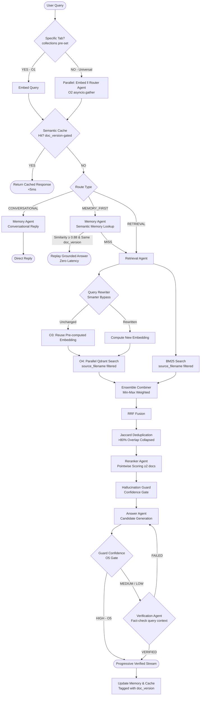
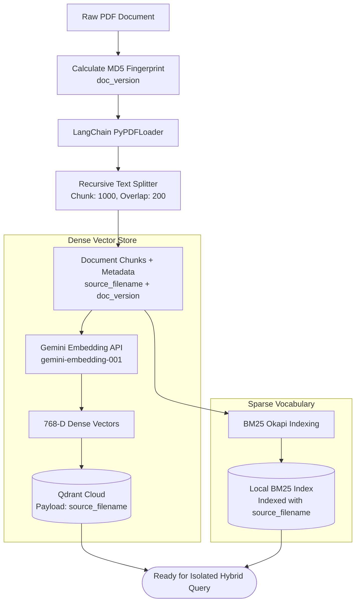

# Multi-Source Agentic RAG System

A production-grade, multi-agent Retrieval-Augmented Generation (RAG) system engineered for high-accuracy domain searching, conversational state awareness, isolated multi-tenant knowledge base retrieval, and ultra-low latency streaming response generation.

---

## 🏗️ System Architecture

The core processing engine is managed by a central **Orchestrator** that coordinates query routing, memory lookup, search orchestration, near-duplicate deduplication, reranking, trust guards, and response synthesis:


```mermaid
flowchart TD
    U([User Query]) --> O1_CHK{Specific Tab?\ncollections pre-set}
    O1_CHK -->|YES - O1| EMB[Embed Query]
    O1_CHK -->|NO - Universal| PAR[Parallel: Embed ‖ Router Agent\nO2 asyncio.gather]
    
    EMB --> SC{Semantic Cache\nHit? doc_version-gated}
    PAR --> SC
    
    SC -->|YES| CRET([Return Cached Response\n<5ms])
    SC -->|NO| RT_BR{Route Type}

    RT_BR -->|CONVERSATIONAL| MA_C[Memory Agent\nConversational Reply]
    MA_C --> ANS_C([Direct Reply])

    RT_BR -->|MEMORY_FIRST| MA_S[Memory Agent\nSemantic Memory Lookup]
    MA_S -->|Similarity ≥ 0.88 & Same doc_version| MEM([Replay Grounded Answer\nZero Latency])
    MA_S -->|MISS| RA[Retrieval Agent]

    RT_BR -->|RETRIEVAL| RA
    RA --> Q_RW{Query Rewriter\nSmarter Bypass}
    Q_RW -->|Unchanged| EMB_REUSE[O3: Reuse Pre-computed Embedding]
    Q_RW -->|Rewritten| EMB_NEW[Compute New Embedding]
    
    EMB_REUSE --> SS[O4: Parallel Qdrant Search\nsource_filename filtered]
    EMB_NEW --> SS
    RA --> BS[BM25 Search\nsource_filename filtered]
    
    SS --> ENS[Ensemble Combiner\nMin-Max Weighted]
    BS --> ENS
    ENS --> RRF[RRF Fusion]
    RRF --> DUP[Jaccard Deduplication\n>80% Overlap Collapsed]
    DUP --> RK[Reranker Agent\nPointwise Scoring ≥2 docs]
    RK --> GD[Hallucination Guard\nConfidence Gate]
    GD --> AA[Answer Agent\nCandidate Generation]
    AA --> CONF_CHK{Guard Confidence\nO5 Gate}
    CONF_CHK -->|HIGH - O5| STR([Progressive Verified Stream])
    CONF_CHK -->|MEDIUM / LOW| VA{Verification Agent\nFact-check query context}
    VA -->|FAILED| AA
    VA -->|VERIFIED| STR
    STR --> UPD[Update Memory & Cache\nTagged with doc_version]
```

---

## ⚡ Performance & API Call Optimizations

The system includes **5 architectural optimizations** that reduce API latency from **~25–35s down to ~8–12s** and decrease per-request LLM calls by **60%**:

| Optimization | Scope | Impact |
| :--- | :--- | :--- |
| **O1. Router Bypass** | Specific Tabs (*Research Papers*, *Code Docs*, etc.) | Bypasses the `RouterAgent` LLM call when tab is pre-selected (**−1 LLM call**). |
| **O2. Parallel Execution** | Universal Tab Queries | Runs `embeddings.embed_query()` and `RouterAgent` in parallel via `asyncio.gather()` (**−800ms**). |
| **O3. Embedding Reuse** | Well-Formed & Unchanged Queries | Reuses original query embedding when query rewriter makes no changes (**−1 Embedding call**). |
| **O4. Parallel Scatter** | Multi-Collection Search | Executes Qdrant searches across all 4 collections simultaneously via `asyncio.gather()` (**−4× RTT**). |
| **O5. Confidence Gate** | High-Confidence Responses | Bypasses `VerificationAgent` for `HIGH` confidence guard scores, reserving verification for uncertain answers (**−1 to −2 LLM calls**). |

---

## 🛡️ Document & Session Context Isolation

To prevent information from previously uploaded PDFs from contaminating responses to newly uploaded documents, the system implements a strict 3-tier isolation contract:

1. **`doc_version` MD5 Fingerprinting**: Each uploaded PDF is assigned an MD5 hash. Semantic cache entries and memory turns are tagged with `doc_version`. Lookups **only hit** if both `session_id` AND `doc_version` match. Uploading a new PDF automatically forces full retrieval without requiring a "New Chat" reset.
2. **`source_filename` Qdrant Payload Filter**: Qdrant vector queries apply an exact-match `source_filename` payload filter, restricting search candidates strictly to the active PDF.
3. **BM25 Lexical Source Isolation**: The in-memory BM25 index stores source metadata per chunk and filters keyword matching to the active file, preventing cross-document keyword bleed.

---

## 📥 Data Ingestion Workflow

The ingestion pipeline processes documents asynchronously for both dense vector and sparse lexical retrieval:


```mermaid
flowchart TD
    PDF[Raw PDF Document] --> MD5[Calculate MD5 Fingerprint\ndoc_version]
    MD5 --> LD[LangChain PyPDFLoader]
    LD --> SP[Recursive Text Splitter\nChunk: 1000, Overlap: 200]
    SP --> CH[Document Chunks + Metadata\nsource_filename + doc_version]
    
    subgraph Vector Leg [Dense Vector Store]
        CH --> V_API[Gemini Embedding API\ngemini-embedding-001]
        V_API --> V_VEC[768-D Dense Vectors]
        V_VEC --> QD[(Qdrant Cloud\nPayload: source_filename)]
    end

    subgraph Lexical Leg [Sparse Vocabulary]
        CH --> B_OKAPI[BM25 Okapi Indexing]
        B_OKAPI --> LIDX[(Local BM25 Index\nIndexed with source_filename)]
    end

    QD --> sync([Ready for Isolated Hybrid Query])
    LIDX --> sync
```

---

## 🤖 Multi-Agent System Architecture

### 1. Router Agent
Classifies query intent. Automatically bypassed (**O1**) when the user operates inside a specific domain tab.

### 2. Memory Agent
Manages conversation turns and semantic cache. Gated by `doc_version` to prevent cross-document memory leaks. Replays past responses when similarity is **`≥ 0.88`** on the same document.

### 3. Retrieval Agent & 3-Stage Fusion
Executes true hybrid retrieval across Qdrant vector search and BM25 lexical search:
1. **Ensemble Combiner**: Min-max normalizes scores from both legs and applies a weighted combination (`semantic: 0.65`, `bm25: 0.35`) with an agreement bonus.
2. **RRF Stability Layer**: Applies Reciprocal Rank Fusion to resolve score distribution ties.
3. **Jaccard Deduplication**: Compares token overlap across candidates and collapses near-duplicate chunks (**>80% Jaccard overlap**), preserving context window space for diverse information.

### 4. Reranker Agent
Applies pointwise Gemini reranking when candidate count is **`≥ 2`**, ensuring top relevance at positions 1–2.

### 5. Hallucination Guard
Evaluates raw cosine similarity scores to determine confidence (`HIGH`, `MEDIUM`, `LOW`, `NONE`). Controls advisory notes and gates downstream verification (**O5**).

### 6. Answer Agent
Generates grounded, source-attributed responses in Markdown format with explicit source headers (`[Source: filename | Page: N]`).

### 7. Verification Agent
Fact-checks generated answers against retrieved context. Bypassed for `HIGH` confidence queries (**O5**) to save latency; runs self-correction loops for `MEDIUM`/`LOW` confidence answers.

---

## 🖥️ User Interface & Cold-Start UX

The Next.js frontend delivers a sleek charcoal dark design with specialized Render deployment support:

*   **Render Cold-Start Detection**: Automatically polls `/health` on app mount. If the free-tier backend is sleeping (~30–50s cold start), renders a non-obtrusive banner with a timer and progress indicator.
*   **Live Status Indicator**: Header pill displays real-time connectivity (🟢 `Server Online`, 🟡 `Waking Up (Xs)`, 🔴 `Offline`).
*   **Terminal Loader Component**: Displays a custom terminal window (`sending-loader.tsx`) with an animated typewriter text effect (`Connecting...` / `Waking Server...`) during initial connection.
*   **Active Document Badge**: Displays the active document name (`📄 report.pdf (Active)`) with a 1-click detach button.
*   **Message Action Controls**: Hover **Copy button** on assistant responses and **↺ Try again** button on error messages.
*   **Keyboard & Navigation Polish**: Tab switch auto-focus, keyboard shortcuts guide (`Enter` send / `Shift+Enter` newline), and dynamic browser tab titles.

---

## 🌐 API Specification

### 1. Unified Chat Endpoint
*   **URL**: `/chat`
*   **Method**: `POST`
*   **Headers**: `Content-Type: application/json`
*   **Payload (JSON)**:
    ```json
    {
      "question": "What are the main findings in the report?",
      "session_id": "research_papers-session-123",
      "collections": ["research_papers"],
      "doc_version": "a3f8c1b2d4e5...",
      "source_filename": "report.pdf"
    }
    ```
*   **Response**: `text/plain` chunk-by-chunk progressive stream.

### 2. Document Ingestion Endpoint
*   **URL**: `/upload?collection=research_papers&session_id=research_papers-session-123`
*   **Method**: `POST`
*   **Payload**: `multipart/form-data` (PDF file)
*   **Response (JSON)**:
    ```json
    {
      "filename": "report.pdf",
      "doc_version": "a3f8c1b2d4e5...",
      "source_filename": "report.pdf",
      "chunks_ingested": 24,
      "collection": "research_papers",
      "message": "Successfully ingested 24 chunks from 'report.pdf'."
    }
    ```

### 3. Server Health Endpoint
*   **URL**: `/health`
*   **Method**: `GET`
*   **Response (JSON)**: `{"status": "ok", "time": 1721750000}`

---

## 📁 Repository Structure

```
backend/
├── main.py                 # FastAPI entry point, lifespan retry & HTTP routes
├── core/
│   ├── config.py           # Environment settings loader
│   ├── llm.py              # Gemini 2.5 Flash setup with 45s timeout
│   ├── embeddings.py       # Gemini Embedding API wrapper
│   └── qdrant_client.py    # Qdrant cloud client instance
├── agents/
│   ├── base.py             # Base agent interface & latency logger
│   ├── orchestrator.py     # Master coordinator & 5-optimization executor
│   ├── router.py           # Intent routing agent
│   ├── memory_agent.py     # Semantic memory & conversational agent
│   ├── retrieval_agent.py  # Hybrid search wrapper agent
│   ├── reranker.py         # Pointwise reranking agent
│   ├── verification_agent.py # Fact-checking & verification agent
│   └── answer_agent.py     # Grounded answer generator
├── retrieval/
│   ├── retriever.py        # Single-embedding, parallel hybrid retriever
│   ├── hybrid.py           # 3-Stage fusion: Ensemble + RRF + Jaccard Dedup
│   ├── planner.py          # Collection routing planner
│   ├── guard.py            # Cosine confidence assessment guard
│   └── bm25_index.py       # BM25 lexical index with source_filename filter
├── ingestion/
│   └── ingestion.py        # PDF chunking, doc_version hashing & Qdrant ingestion
├── memory/
│   └── memory.py           # Session chat history with doc_version gating
└── cache/
    └── cache.py            # doc_version-gated semantic response cache

frontend/
├── app/
│   ├── page.tsx            # Multi-mode RAG client interface with cold-start UX
│   ├── layout.tsx          # App layout & metadata configuration
│   └── globals.css         # Charcoal dark theme & typewriter animations
├── components/
│   └── ui/
│       └── sending-loader.tsx # Terminal loading component with typewriter effect
└── package.json            # Client dependency manifest
```
